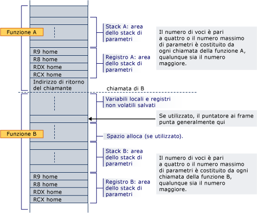

# Allocazione nello stack
Prologo di una funzione è responsabile dell'allocazione di spazio dello stack per le variabili locali, i registri salvati, dello stack di parametri e dei parametri di registro.  
  
 L'area dei parametri è sempre nella parte inferiore dello stack (anche se viene usato l'allocazione), in modo che sarà sempre adiacente all'indirizzo del mittente durante qualsiasi chiamata di funzione. Contiene le voci di almeno quattro, ma sempre spazio sufficiente per contenere tutti i parametri necessari da qualsiasi funzione che può essere chiamato. Si noti che è sempre allocato per i parametri del registro, anche se tali parametri non vengono mai trasferiti nello stack. un oggetto chiamato è garantito che sia stato allocato spazio per tutti i relativi parametri. Gli indirizzi personali sono necessari per gli argomenti dei registri in modo da un'area contigua disponibile nel caso in cui la funzione chiamata deve accettare l'indirizzo dell'elenco di argomenti (va_list) o un singolo argomento. Quest'area inoltre offre la possibilità per salvare gli argomenti di registro durante l'esecuzione del thunk e come opzione di debug (ad esempio, consente gli argomenti di trovare facilmente durante il debug se sono memorizzate nei relativi indirizzi iniziali nel codice di prologo). Anche se la funzione chiamata dispone di meno di 4 parametri, questi percorsi 4 stack sono di proprietà in modo efficace dalla funzione chiamata e possono essere utilizzati dalla funzione chiamata per altri scopi oltre il salvataggio di valori del Registro di parametro.  In questo modo il chiamante non può salvare informazioni in questa area dello stack in una chiamata di funzione.  
  
 Se lo spazio viene allocato dinamicamente (allocazione) in una funzione, quindi un registro non volatile deve essere utilizzato come puntatore ai frame per contrassegnare la base della parte fissa dello stack e tale registro deve essere salvato e inizializzato nel prologo. Si noti che quando viene utilizzato l'allocazione, chiamate allo stesso chiamato dallo stesso chiamante possono avere indirizzi iniziali differenti per i parametri del registro.  
  
 Lo stack verrà sempre mantenuto a 16 byte allineati, tranne che all'interno del prologo (ad esempio, dopo che viene inserito l'indirizzo del mittente) e quando indicato in [tipi di funzione](../build/function-types.md) per una determinata classe di funzioni frame.  
  
 Di seguito è riportato un esempio di layout dello stack di chiamate di funzione non foglia funzionano where prologo b è già allocato spazio per tutti i parametri di registro e di stack richiesti da B nella parte inferiore dello stack. La chiamata inserisce l'indirizzo del mittente e prologo B alloca spazio per le variabili locali, i registri non volatili e lo spazio necessario per chiamare le funzioni. Se B utilizza l'istruzione alloca, lo spazio viene allocato tra il registro non volatile di variabile/locale Salva area e l'area dello stack del parametro.  
  
   
  
 Quando la funzione B chiama un'altra funzione, viene inserito l'indirizzo del mittente sotto l'indirizzo dell'abitazione di RCX.  
  
## Vedere anche  
 [Uso dello stack](../build/stack-usage.md)