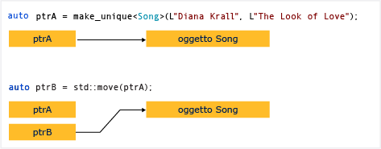

# Procedura: creare e utilizzare istanze unique_ptr

Oggetto [unique_ptr](../standard-library/unique-ptr-class.md) condivide il puntatore. Non può essere copiato in un altro `unique_ptr`, passato per valore a una funzione o utilizzato in qualsiasi algoritmo della libreria Standard C++ che richiede di copie. È possibile solo spostare un oggetto `unique_ptr`. Ciò significa che la proprietà della risorsa di memoria viene trasferita a un altro `unique_ptr` e l'oggetto `unique_ptr` originale non è più proprietario della risorsa. Si consiglia di limitare un oggetto a un solo proprietario, poiché la proprietà multipla rende più complessa la logica del programma. Pertanto, quando è necessario un puntatore intelligente per un oggetto C++ normale, utilizzare `unique_ptr`, e quando si costruisce una `unique_ptr`, utilizzare il [make_unique](../standard-library/memory-functions.md#make_unique) funzione di supporto.

Nel diagramma seguente è illustrato il passaggio di proprietà tra due istanze di `unique_ptr`.

`unique_ptr` è definito nel `<memory>` intestazione della libreria Standard C++. È esattamente efficiente quanto un puntatore non elaborato e può essere usato nei contenitori della libreria Standard C++. L'aggiunta di `unique_ptr` istanze di contenitori della libreria Standard C++ è efficiente poiché il costruttore di spostamento del `unique_ptr` Elimina la necessità di un'operazione di copia.

## Esempio

Nell'esempio seguente viene illustrato come creare istanze di `unique_ptr` e passarle tra funzioni.

[!code-cpp[stl_smart_pointers#210](../cpp/codesnippet/CPP/how-to-create-and-use-unique-ptr-instances_1.cpp)]

In questi esempi viene illustrata la caratteristica di base di `unique_ptr`, che può essere spostato, ma non copiato. Lo spostamento ("move") trasferisce la proprietà a un nuovo oggetto `unique_ptr` e reimposta l'oggetto `unique_ptr`precedente.

## Esempio

Nell'esempio seguente viene illustrato come creare istanze di `unique_ptr` e utilizzarle in un vettore.

[!code-cpp[stl_smart_pointers#211](../cpp/codesnippet/CPP/how-to-create-and-use-unique-ptr-instances_2.cpp)]

Nell'intervallo per il ciclo, si noti che `unique_ptr` viene passato per riferimento. Se si tenta di passare per valore, il compilatore genererà un errore perché il costruttore di copia `unique_ptr` viene eliminato.

## Esempio

Nell'esempio seguente viene illustrato come inizializzare un `unique_ptr` che è un membro di classe.

[!code-cpp[stl_smart_pointers#212](../cpp/codesnippet/CPP/how-to-create-and-use-unique-ptr-instances_3.cpp)]

## Esempio

È possibile usare [make_unique](../standard-library/memory-functions.md#make_unique) per creare un `unique_ptr` in una matrice, ma non è possibile usare `make_unique` per inizializzare gli elementi della matrice.

[!code-cpp[stl_smart_pointers#213](../cpp/codesnippet/CPP/how-to-create-and-use-unique-ptr-instances_4.cpp)]

Per altri esempi, vedere [make_unique](../standard-library/memory-functions.md#make_unique).

## Vedere anche

[Puntatori intelligenti](../cpp/smart-pointers-modern-cpp.md) 
[make_unique](../standard-library/memory-functions.md#make_unique)