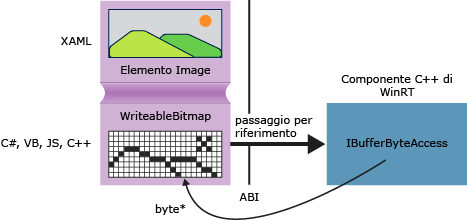

# <a name="obtaining-pointers-to-data-buffers-ccx"></a>Recupero di puntatori a buffer di dati (C++/CX)

In Windows Runtime l'interfaccia [Windows::Storage::Streams::IBuffer](/uwp/api/windows.storage.streams.ibuffer) fornisce un modo indipendente dalla lingua e basato sui flussi per accedere ai buffer di dati. In C++ puoi ottenere un puntatore non elaborato alla matrice di byte sottostante utilizzando l'interfaccia IBufferByteAccess della libreria di Windows Runtime definita in robuffer.h. Con questo approccio puoi modificare la matrice di byte sul posto senza creare inutili copie dei dati.

Il diagramma seguente mostra un elemento immagine XAML, la cui origine è [Windows::UI::Xaml::Media::Imaging WriteableBitmap](/uwp/api/Windows.UI.Xaml.Media.Imaging.WriteableBitmap). Un'app client scritta in qualsiasi linguaggio può passare un riferimento a `WriteableBitmap` al codice C++, quindi C++ può utilizzare il riferimento per ottenere il buffer sottostante. In un'app Universal Windows Platform scritta in C++, è possibile usare la funzione nell'esempio seguente direttamente nel codice sorgente senza comprimerlo in un componente Windows Runtime.



## <a name="getpointertopixeldata"></a>GetPointerToPixelData

Il metodo seguente accetta [Windows::Storage::Streams::IBuffer](/uwp/api/windows.storage.streams.ibuffer) e restituisce un puntatore non elaborato alla matrice di byte sottostante. Per chiamare la funzione, passare una proprietà [WriteableBitmap::PixelBuffer](/uwp/api/windows.ui.xaml.media.imaging.writeablebitmap.pixelbuffer) .

```cpp
#include <wrl.h>
#include <robuffer.h>
using namespace Windows::Storage::Streams;
using namespace Microsoft::WRL;
typedef uint8 byte;
// Retrieves the raw pixel data from the provided IBuffer object.
// Warning: The lifetime of the returned buffer is controlled by
// the lifetime of the buffer object that's passed to this method.
// When the buffer has been released, the pointer becomes invalid
// and must not be used.
byte* Class1::GetPointerToPixelData(IBuffer^ pixelBuffer, unsigned int *length)
{
    if (length != nullptr)
    {
        *length = pixelBuffer ->Length;
    }
    // Query the IBufferByteAccess interface.
    ComPtr<IBufferByteAccess> bufferByteAccess;
    reinterpret_cast<IInspectable*>( pixelBuffer)->QueryInterface(IID_PPV_ARGS(&bufferByteAccess));

    // Retrieve the buffer data.
    byte* pixels = nullptr;
    bufferByteAccess->Buffer(&pixels);
    return pixels;
}
```

## <a name="complete-example"></a>Esempio completo

La procedura seguente illustra come creare un'app c# (Universal Windows Platform) che passa un `WriteableBitmap` per una DLL del componente C++ di Windows Runtime. Il codice C++ ottiene un puntatore al buffer di pixel ed esegue una semplice modifica dell'immagine sul posto. In alternativa, puoi creare l'app client in Visual Basic, in JavaScript o in C++, anziché C#. Se usi C++, non è necessaria la DLL del componente. Puoi semplicemente aggiungere tali metodi direttamente alla classe MainPage o a un'altra classe che definisci.

#### <a name="create-the-client"></a>Creare il client

1. Usare il modello di progetto app vuota per creare un'app c# (Universal Windows Platform).

1. In MainPage.xaml

   - Usa questo codice XAML per sostituire l'elemento `Grid` :

        ```xml
        <Grid Background="{StaticResource ApplicationPageBackgroundThemeBrush}">
            <StackPanel HorizontalAlignment="Left" Margin="176,110,0,0" VerticalAlignment="Top" Width="932">
                <Image x:Name="Pic"/>
                <Button Content="Process Image" HorizontalAlignment="Stretch" VerticalAlignment="Stretch" Height="47" Click="Button_Click_1"/>
            </StackPanel>
        </Grid>
        ```

1. In MainPage.xaml.cs

   1. Aggiungi queste dichiarazioni dello spazio dei nomi:

        ```csharp
        using Windows.Storage;
        using Windows.Storage.FileProperties;
        using Windows.UI.Xaml.Media.Imaging;
        using Windows.Storage.Streams;
        using Windows.Storage.Pickers;
        ```

   1. Aggiungi una variabile membro `WriteableBitmap` alla classe `MainPage` e assegnale il nome `m_bm`.

        ```csharp
        private WriteableBitmap m_bm;
        ```

   1. Usa il codice seguente per sostituire lo stub del metodo `OnNavigatedTo` . All'avvio dell'app viene visualizzato il selettore di file. La parola chiave `async` viene aggiunta alla firma della funzione.

        ```csharp
        async protected override void OnNavigatedTo(NavigationEventArgs e)
        {
            FileOpenPicker openPicker = new FileOpenPicker();
            openPicker.ViewMode = PickerViewMode.Thumbnail;
            openPicker.SuggestedStartLocation = PickerLocationId.PicturesLibrary;
            openPicker.FileTypeFilter.Add(".jpg");
            openPicker.FileTypeFilter.Add(".jpeg");
            openPicker.FileTypeFilter.Add(".png");

            StorageFile file = await openPicker.PickSingleFileAsync();
            if (file != null)
            {
                // Get the size of the image for the WriteableBitmap constructor.
                ImageProperties props = await file.Properties.GetImagePropertiesAsync();
                m_bm = new WriteableBitmap((int)props.Height, (int)props.Width);
                m_bm.SetSource(await file.OpenReadAsync());
                Pic.Source = m_bm;
            }
            else
            {
                //  Handle error...
            }
        }
        ```

   1. Aggiungi il gestore eventi per il clic del pulsante. Poiché il riferimento allo spazio dei nomi `ImageManipCPP` non è ancora stato creato, potrebbe avere una sottolineatura ondulata nella finestra dell'editor.

        ```csharp
        async private void Button_Click_1(object sender, RoutedEventArgs e)
        {
            ImageManipCPP.Class1 obj = new ImageManipCPP.Class1();
            await obj.Negativize(m_bm);
            Pic.Source = m_bm;
        }
        ```

#### <a name="create-the-c-component"></a>Creare il componente C++

1. Aggiungere un nuovo componente di Runtime di Windows C++ alla soluzione esistente e denominarlo `ImageManipCPP`. Aggiungi un riferimento al progetto C# facendo clic con il pulsante destro del mouse sul progetto in **Esplora soluzioni** e scegliendo **Aggiungi**, **Riferimento**.

1. In Class1.h

   1. Aggiungi questo `typedef` nella seconda riga, subito dopo `#pragma once`:

        ```cpp
        typedef uint8 byte;
        ```

   1. Aggiungi l'attributo `WebHostHidden` sopra l'inizio della dichiarazione di `Class1` .

        ```cpp
        [Windows::Foundation::Metadata::WebHostHidden]
        ```

   1. Aggiungi questa firma del metodo pubblico a `Class1`:

        ```cpp
        Windows::Foundation::IAsyncAction^ Negativize(Windows::UI::Xaml::Media::Imaging::WriteableBitmap^ bm);
        ```

   1. Aggiungi la firma del metodo `GetPointerToPixelData` indicata nel frammento di codice precedente. Assicurati che il metodo sia privato.

1. In Class1.cpp

   1. Aggiungi le direttive `#include` e le dichiarazioni dello spazio dei nomi:

        ```cpp
        #include <ppltasks.h>
        #include <wrl.h>
        #include <robuffer.h>

        using namespace Windows::Storage;
        using namespace Windows::UI::Xaml::Media::Imaging;
        using namespace Windows::Storage::Streams;
        using namespace Microsoft::WRL;
        ```

   1. Aggiungi l'implementazione di `GetPointerToPixelData` dal frammento di codice precedente.

   1. Aggiungi l'implementazione di `Negativize`. Questo metodo crea un effetto simile al negativo di una pellicola invertendo ogni valore RGB nel pixel. Rendiamo il metodo asincrono in quanto per le immagini più grandi il completamento può richiedere una quantità di tempo percettibile.

        ```cpp
        IAsyncAction^ Class1::Negativize(WriteableBitmap^ bm)
        {
            unsigned int length;
            byte* sourcePixels = GetPointerToPixelData(bm->PixelBuffer, &length);
            const unsigned int width = bm->PixelWidth;
            const unsigned int height = bm->PixelHeight;

            return create_async([this, width, height, sourcePixels]
            {
                byte* temp = sourcePixels;
                for(unsigned int k = 0; k < height; k++)
                {
                    for (unsigned int i = 0; i < (width * 4); i += 4)
                    {
                        int pos = k * (width * 4) + (i);
                        temp[pos] = ~temp[pos];
                        temp[pos + 1] = ~temp[pos + 1] / 3;
                        temp[pos + 2] = ~temp[pos + 2] / 2;
                        temp[pos + 3] = ~temp[pos + 3];
                    }
                }
            });

        }
        ```

      > [!NOTE]
      > Questo metodo può essere eseguito più velocemente se usi AMP o la libreria PPL per parallelizzare l'operazione.

1. Verifica di avere almeno un'immagine nella cartella delle immagini, quindi premi F5 per compilare ed eseguire il programma.
