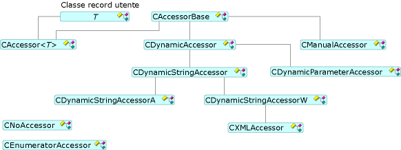

# Funzioni di accesso e rowset

Per impostare e recuperare i dati, modelli OLE DB utilizza una funzione di accesso e un set di righe tramite il [CAccessorRowset](../../data/oledb/caccessorrowset-class.md) classe. Questa classe può gestire più funzioni di accesso di tipo diverso.

## Tipi di funzione di accesso

Tutte le funzioni di accesso derivano da [CAccessorBase](../../data/oledb/caccessorbase-class.md). `CAccessorBase` Fornisce i parametri e associazione di colonna.

La figura seguente illustra i tipi di funzione di accesso.

 
Classi di funzione di accesso

- [CAccessor](../../data/oledb/caccessor-class.md) utilizzare questa funzione di accesso quando si conosce la struttura del database in fase di progettazione. `CAccessor` Associa un record di database, che contiene il buffer, in modo statico all'origine dati.

- [CDynamicAccessor](../../data/oledb/cdynamicaccessor-class.md) usare la funzione di accesso quando non si conosce la struttura del database in fase di progettazione. `CDynamicAccessor` le chiamate `IColumnsInfo::GetColumnInfo` per ottenere le informazioni di colonna di database. Crea e gestisce il buffer e una funzione di accesso.

- [CDynamicParameterAccessor](../../data/oledb/cdynamicparameteraccessor-class.md) usare la funzione di accesso per gestire i tipi di comando sconosciuto. Quando si preparano i comandi `CDynamicParameterAccessor` può ottenere informazioni sui parametri dal `ICommandWithParameters` dell'interfaccia, se il provider supporta `ICommandWithParameters`.

- [CDynamicStringAccessor](../../data/oledb/cdynamicstringaccessor-class.md), [CDynamicStringAccessorA](../../data/oledb/cdynamicstringaccessora-class.md), e [CDynamicStringAccessorW](../../data/oledb/cdynamicstringaccessorw-class.md) usano queste classi quando non si dispone di alcuna conoscenza dello schema del database. `CDynamicStringAccessorA` Recupera i dati sotto forma di stringhe ANSI; `CDynamicStringAccessorW` recupera i dati come stringhe Unicode.

- [CManualAccessor](../../data/oledb/cmanualaccessor-class.md) con questa classe, è possibile usare tutti i tipi di dati che si desidera se il provider può convertire il tipo. Gestisce sia le colonne di risultati e i parametri di comando.

La tabella seguente riepiloga il supporto nei tipi di funzione di accesso di modelli OLE DB.

|Tipo di funzione di accesso|Dynamic|Gestisce params|Buffer|Più funzioni di accesso|
|-------------------|-------------|--------------------|------------|------------------------|
|`CAccessor`|No|Yes|Utente|Yes|
|`CDynamicAccessor`|Yes|No|Modelli OLE DB|No|
|`CDynamicParameterAccessor`|Yes|Yes|Modelli OLE DB|No|
|`CDynamicStringAccessor[A,W]`|Sì|No|Modelli OLE DB|No|
|`CManualAccessor`|Yes|Yes|Utente|Yes|

## Tipi di rowset

I modelli OLE DB supporta tre tipi di set di righe (vedere la figura precedente): singolo set di righe (implementato da [CRowset](../../data/oledb/crowset-class.md)), rowset di massa (implementata da [CBulkRowset](../../data/oledb/cbulkrowset-class.md)) e i set di righe (implementato di matrice dal [CArrayRowset](../../data/oledb/carrayrowset-class.md)). Recupero di rowset singoli handle di una singola riga quando `MoveNext` viene chiamato. Set di righe BULK può recuperare più handle di riga. Rowset di matrici sono i set di righe che sono accessibili tramite la sintassi della matrice.

La figura seguente illustra i tipi di set di righe.

 
Classi rowset

[I set di righe dello schema](../../data/oledb/obtaining-metadata-with-schema-rowsets.md) non accesso nei dati di archivio dati, ma invece accedere alle informazioni sull'archivio dati, note come metadati. I set di righe dello schema vengono in genere usati nelle situazioni in cui la struttura del database non è noto in fase di compilazione e deve essere ottenuta in fase di esecuzione.

## Vedere anche

[Modelli Consumer OLE DB](../../data/oledb/ole-db-consumer-templates-cpp.md)