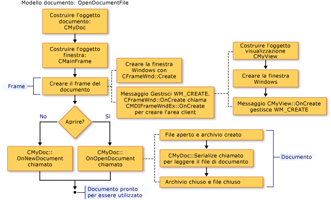

# Creazione di nuovi documenti, finestre e visualizzazioni
Le figure seguenti è fornita una panoramica del processo di creazione di documenti, visualizzazioni e finestre cornice. Altri articoli che lo stato attivo per gli oggetti partecipanti forniscono altri dettagli.  
  
 Al termine di questo processo, gli oggetti che cooperano esistano e archiviano i puntatori a altro. Le figure seguenti mostrano la sequenza in cui gli oggetti vengono creati. È possibile seguire la sequenza da una figura al.  
  
   
Sequenza di creazione di un documento  
  
   
Sequenza di creazione di una finestra cornice  
  
   
Sequenza di creazione di una visualizzazione  
  
 Per informazioni su come il framework consente di inizializzare il nuovo documento, visualizzazione e gli oggetti della finestra cornice, vedere le classi [CDocument](../mfc/reference/cdocument-class.md), [CView](../mfc/reference/cview-class.md), [CFrameWnd](../mfc/reference/cframewnd-class.md), [CMDIFrameWnd](../mfc/reference/cmdiframewnd-class.md), e [CMDIChildWnd](../mfc/reference/cmdichildwnd-class.md) in riferimenti alla libreria MFC. Vedere anche [Nota tecnica 22](../mfc/tn022-standard-commands-implementation.md), che spiega i processi di creazione e inizializzazione ulteriormente con la relativa descrizione comandi standard del framework, per il `New` e **aprire** gli elementi di **File** menu.  
  
##  L'inizializzazione personalizzate aggiunte a queste classi  
 Figure precedenti inoltre suggeriscono i punti in cui è possibile eseguire l'override di funzioni membro per inizializzare gli oggetti dell'applicazione. Un override di `OnInitialUpdate` nella propria visualizzazione classe è il luogo migliore per inizializzare la visualizzazione. Il `OnInitialUpdate` chiamata si verifica immediatamente dopo la finestra cornice viene creata e la visualizzazione all'interno della finestra cornice è collegata al documento. Ad esempio, se la vista è una visualizzazione a scorrimento (derivato da `CScrollView` anziché `CView`), è necessario impostare le dimensioni di visualizzazione in base alla dimensione del documento nel `OnInitialUpdate` eseguire l'override. (Questo processo è descritto nella descrizione della classe [CScrollView](../mfc/reference/cscrollview-class.md).) È possibile eseguire l'override di **CDocument** funzioni membro `OnNewDocument` e `OnOpenDocument` per fornire specifici dell'applicazione l'inizializzazione del documento. In genere, è necessario eseguire l'override sia poiché è possibile creare un documento in due modi.  
  
 Nella maggior parte dei casi, l'override deve chiamare la versione della classe base. Per ulteriori informazioni, vedere le funzioni membro denominate delle classi [CDocument](../mfc/reference/cdocument-class.md), [CView](../mfc/reference/cview-class.md), [CFrameWnd](../mfc/reference/cframewnd-class.md), e [CWinApp](../mfc/reference/cwinapp-class.md) in MFC Riferimenti alla libreria.  
  
## Vedere anche  
 [Modelli di documento e il processo di creazione documento/visualizzazione](../mfc/document-templates-and-the-document-view-creation-process.md)   
 [Creazione del modello di documento](../mfc/document-template-creation.md)   
 [Creazione di documenti/visualizzazioni](../mfc/document-view-creation.md)   
 [Relazioni tra oggetti MFC](../mfc/relationships-among-mfc-objects.md)

