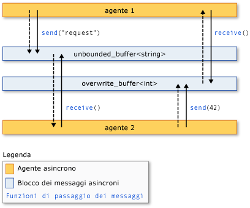

# libreria di agenti asincroni
[!INCLUDE[vs2017banner](../../assembler/inline/includes/vs2017banner.md)]

Libreria di agenti asincroni (o semplicemente *libreria di agenti*) fornisce un modello di programmazione che consente di aumentare l'affidabilità dello sviluppo di applicazioni abilitate per la concorrenza. La libreria di agenti è una libreria di modelli C++ che promuove un modello di programmazione basato su attori e i messaggi in-process attività di pipelining e il passaggio per flussi di dati con granularità grossolana. La libreria di agenti si basa sui componenti di gestione risorse e pianificazione del Runtime di concorrenza.  
  
## <a name="programming-model"></a>Modello di programmazione  
 La libreria di agenti offre alternative allo stato condiviso consentendo di connettere componenti isolati tramite un modello di comunicazione asincrona basato su flussi di dati anziché il flusso di controllo. *Flussi di dati* fa riferimento alla programmazione di una modello in cui i calcoli vengono eseguiti quando tutti i dati necessari è disponibile; *flusso di controllo* fa riferimento a un modello di programmazione in cui i calcoli vengono eseguiti in un ordine predeterminato.  
  
 Il modello di programmazione del flusso di dati è correlato al concetto di *passaggio dei messaggi*, in cui i componenti indipendenti di un programma di comunicano tra loro mediante l'invio di messaggi.  
  
 La libreria di agenti è composta da tre componenti: *agenti asincroni*, *blocchi dei messaggi asincroni*, e *le funzioni di passaggio dei messaggi*. Gli agenti mantengono lo stato e utilizzano i blocchi dei messaggi e funzioni di passaggio dei messaggi per comunicare tra loro e con componenti esterni. Funzioni di passaggio dei messaggi consentono agli agenti di inviare e ricevere messaggi da e verso i componenti esterni. Blocchi dei messaggi asincroni trattenere i messaggi e consentono agli agenti di comunicare in modo sincronizzato.  
  
 Nella figura seguente viene illustrato come due agenti utilizzare blocchi dei messaggi e funzioni di passaggio dei messaggi per comunicare. In questa illustrazione, `agent1` Invia un messaggio al `agent2` utilizzando il [Concurrency:: Send](../Topic/send%20Function.md) (funzione) e un [Concurrency:: unbounded_buffer](../Topic/unbounded_buffer%20Class.md) oggetto. `agent2` Usa il [Concurrency:: Receive](../Topic/receive%20Function.md) funzione per leggere il messaggio. `agent2` Usa lo stesso metodo per inviare un messaggio a `agent1`. Le frecce tratteggiate rappresentano il flusso di dati tra gli agenti. Le frecce continue connettono gli agenti ai blocchi di messaggio che scrivere o leggere.  
  
   
  
 Un esempio di codice che implementa questa figura è illustrato più avanti in questo argomento.  
  
 Il modello di programmazione agente presenta alcuni vantaggi rispetto altri meccanismi di sincronizzazione e concorrenza, ad esempio, gli eventi. Un vantaggio è che tramite il passaggio di messaggi per trasmettere le modifiche di stato tra gli oggetti, è possibile isolare l'accesso alle risorse condivise e migliorare la scalabilità. Un vantaggio di passaggio dei messaggi è che collega la sincronizzazione di dati anziché il blocco a un oggetto di sincronizzazione esterno. Ciò semplifica la trasmissione dei dati tra i componenti e consente di eliminare gli errori di programmazione delle applicazioni.  
  
## <a name="when-to-use-the-agents-library"></a>Quando utilizzare la libreria di agenti  
 Utilizzare la libreria di agenti quando si dispone di più operazioni che devono comunicare tra loro in modo asincrono. Blocchi dei messaggi e funzioni di passaggio dei messaggi consentono di scrivere applicazioni parallele senza meccanismi di sincronizzazione, ad esempio i blocchi. Questo consente di concentrarsi sulla logica dell'applicazione.  
  
 Il modello di programmazione dell'agente viene spesso utilizzato per creare *pipeline di dati* o *reti*. Una pipeline di dati è una serie di componenti, ognuno dei quali esegue un'attività specifica che contribuisce a un obiettivo più grande. Ogni componente in una pipeline di dati esegue operazioni quando si riceve un messaggio da un altro componente. Il risultato di tale lavoro viene passato ad altri componenti della pipeline o rete. I componenti possono utilizzare altre funzionalità di concorrenza con granularità fine da altre librerie, ad esempio, il [libreria PPL (Parallel Patterns Library)](../../parallel/concrt/parallel-patterns-library-ppl.md).  
  
## <a name="example"></a>Esempio  
 Nell'esempio seguente viene implementata l'illustrazione mostrata in precedenza in questo argomento.  
  
 [!code-cpp[concrt-basic-agents#1](../../parallel/concrt/codesnippet/CPP/asynchronous-agents-library_1.cpp)]  
  
 Questo esempio produce il seguente output:  
  
```Output  
agent1: sending request...  
agent2: received 'request'.  
agent2: sending response...  
agent1: received '42'.  
```  
  
 Gli argomenti seguenti descrivono le funzionalità utilizzate in questo esempio.  
  
## <a name="related-topics"></a>Argomenti correlati  
 [Agenti asincroni](../../parallel/concrt/asynchronous-agents.md)  
 Viene descritto il ruolo di agenti asincroni nella risoluzione maggiore attività di elaborazione.  
  
 [Blocchi dei messaggi asincroni](../../parallel/concrt/asynchronous-message-blocks.md)  
 Descrive i diversi tipi di blocco di messaggi che vengono forniti dalla libreria di agenti.  
  
 [Funzioni di passaggio dei messaggi](../../parallel/concrt/message-passing-functions.md)  
 Vengono descritte le routine di passaggio messaggi diversi forniti dalla libreria di agenti.  
  
 [Procedura: implementare vari modelli Producer-Consumer](../../parallel/concrt/how-to-implement-various-producer-consumer-patterns.md)  
 Viene descritto come implementare il modello producer-consumer nell'applicazione.  
  
 [Procedura: fornire funzioni lavoro alle classi call e transformer](../../parallel/concrt/how-to-provide-work-functions-to-the-call-and-transformer-classes.md)  
 Vengono illustrati vari modi per fornire funzioni lavoro al [Concurrency:: Call](../../parallel/concrt/reference/call-class.md) e [Concurrency:: transformer](../../parallel/concrt/reference/transformer-class.md) classi.  
  
 [Procedura: utilizzare la classe transformer in una Pipeline di dati](../../parallel/concrt/how-to-use-transformer-in-a-data-pipeline.md)  
 Viene illustrato come utilizzare il [Concurrency:: transformer](../../parallel/concrt/reference/transformer-class.md) classe in una pipeline di dati.  
  
 [Procedura: selezionare tra le attività completate](../../parallel/concrt/how-to-select-among-completed-tasks.md)  
 Viene illustrato come utilizzare il [Concurrency:: Choice](../../parallel/concrt/reference/choice-class.md) e [Concurrency:: join](../../parallel/concrt/reference/join-class.md) classi per selezionare la prima attività da completare un algoritmo di ricerca.  
  
 [Procedura: inviare un messaggio a intervalli regolari](../../parallel/concrt/how-to-send-a-message-at-a-regular-interval.md)  
 Viene illustrato come utilizzare il [Concurrency:: timer](../../parallel/concrt/reference/timer-class.md) classe per inviare un messaggio a intervalli regolari.  
  
 [Procedura: utilizzare un filtro di blocco di messaggi](../../parallel/concrt/how-to-use-a-message-block-filter.md)  
 Di seguito viene illustrato come utilizzare un filtro per consentire a un blocco di messaggi asincroni di accettare o rifiutare i messaggi.  
  
 [Parallel Patterns Library (PPL)](../../parallel/concrt/parallel-patterns-library-ppl.md)  
 Viene descritto come utilizzare i vari modelli paralleli, ad esempio gli algoritmi paralleli, nelle applicazioni.  
  
 [Runtime di concorrenza](../../parallel/concrt/concurrency-runtime.md)  
 Descrive il runtime di concorrenza che semplifica la programmazione parallela e contiene i collegamenti ad argomenti correlati.

