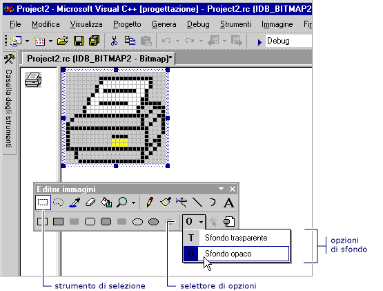

# Selezione di uno sfondo opaco o trasparente (Editor di immagini per le icone)
Quando si sposta o si copia una selezione da un'immagine, qualsiasi pixel della selezione che corrispondono al colore di sfondo corrente sono transparent per impostazione predefinita, essi non nascondano pixel nel percorso di destinazione.  
  
 È possibile passare da uno sfondo trasparente (predefinito) a uno sfondo opaco e viceversa. Quando si utilizza uno strumento di selezione, il **sfondo trasparente** e **sfondo opaco** opzioni vengono visualizzate nel selettore di opzioni nella **Editor di immagini** barra degli strumenti (come illustrato di seguito).  
  
   
Opzioni trasparenti e opache sulla barra degli strumenti dell'Editor di immagini  
  
### Per passare da uno sfondo trasparente e opaco  
  
1.  Nel **Editor di immagini** sulla barra degli strumenti, fare clic su di **opzione** selettore e quindi fare clic sull'icona appropriata:  
  
    -   **Sfondo opaco (O)**: immagine esistente viene coperta da tutte le parti della selezione.  
  
    -   **Sfondo trasparente (T)**: immagine esistente viene illustrato nelle parti della selezione che corrispondono al colore di sfondo corrente.  
  
 \- oppure -  
  
-   Nel **immagine** menu, seleziona o deselezionare **opaco**.  
  
 È possibile modificare il colore di sfondo durante l'esecuzione di una selezione attiva per modificare le parti dell'immagine sono transparent.  
  
 Per informazioni sull'aggiunta di risorse a progetti gestiti, vedere [risorse nelle applicazioni Desktop](/dotnet/framework/resources/index) nel *Guida per gli sviluppatori di .NET Framework.* Per informazioni sull'aggiunta manuale di file di risorse a progetti gestiti, sull'accesso alle risorse, visualizzazione di risorse statiche e sull'assegnazione di stringhe di risorse alle proprietà, vedere [la creazione di file di risorse per le app Desktop](/dotnet/framework/resources/creating-resource-files-for-desktop-apps). Per informazioni sulla globalizzazione e localizzazione di risorse nelle applicazioni gestite, vedere [globalizzazione e localizzazione di applicazioni .NET Framework](/dotnet/standard/globalization-localization/index).  
  
 Requisiti  
  
 nessuno  
  
## Vedere anche  
 [Tasti di scelta rapida](../windows/accelerator-keys-image-editor-for-icons.md)   
 [Utilizzo dei colori](../windows/working-with-color-image-editor-for-icons.md)