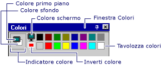

# Finestra Colori (Editor di immagini per le icone)

Il **colori** finestra dispone di due parti:

- Il **tavolozza di colori**, che è una matrice di campioni di colore che rappresentano i colori disponibili. È possibile selezionare gli esempi per scegliere i colori di primo piano e sfondo quando si usano gli strumenti di grafica.

- Il **indicatore colori**, che mostra i colori di sfondo e primo piano e i selettori per il colore dello schermo e inverso.

    
   Finestra Colori

> [!NOTE]
> Il **schermata colore** e **inversione di colore** strumenti sono disponibili solo per le icone e cursori.

È possibile usare la **colori** finestra con il [sulla barra degli strumenti Editor di immagini](../windows/toolbar-image-editor-for-icons.md).

## Per visualizzare la finestra colori

Pulsante destro del mouse un' **Editor di immagini** riquadro, quindi scegliere **Visualizza finestra colori** dal menu di scelta rapida.

   \- oppure -

Selezionare **Visualizza finestra colori** nel [menu immagine](../windows/image-menu-image-editor-for-icons.md).

## Per nascondere la finestra colori

È possibile rimuovere la finestra. Questa azione consentirà la finestra Nascondi automaticamente quando non è in uso.

\- oppure -

Selezionare il **Chiudi** pulsante.

## Requisiti

nessuno

## Vedere anche

[Creazione di aree trasparenti o di inversione nelle immagini per i dispositivi](../windows/creating-transparent-or-inverse-regions-in-device-images.md) 
[Tasti di scelta rapida](../windows/accelerator-keys-image-editor-for-icons.md) 
[Finestra di dialogo del selettore di colore personalizzato](../windows/custom-color-selector-dialog-box-image-editor-for-icons.md) 
[Editor di immagini per le icone](../windows/image-editor-for-icons.md)