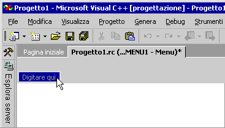
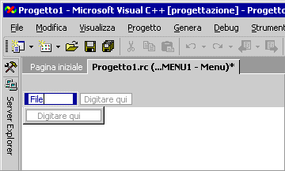

# <a name="menu-editor-c"></a>Editor menu (C++)

I menu consentono di disporre i comandi in modo logico e facile da trovare. Con l' **editor di menu**è possibile creare e modificare i menu lavorando direttamente con una barra dei menu molto simile a quella dell'applicazione finita.

> [!TIP]
> Quando si usa l' **editor di menu**, in molti casi è possibile fare clic con il pulsante destro del mouse per visualizzare un menu a comparsa con i comandi usati di frequente. I comandi disponibili dipendono dalla destinazione a cui fa riferimento il puntatore.

## <a name="how-to"></a>Procedure

L' **editor di menu** consente di:

### <a name="to-create-a-standard-menu"></a>Per creare un menu standard

1. Passare alla **visualizzazione** menu > **altre finestre** > **visualizzazione risorse** e fare clic con il pulsante destro del mouse sull'intestazione di **menu** . Scegliere **Aggiungi risorsa**, quindi **menu**.

1. Selezionare la casella **nuovo elemento** (il rettangolo che contiene il *tipo qui*) sulla barra dei menu.

   <br/>
   Casella **nuovo elemento**

1. Digitare un nome per il nuovo menu, ad esempio *file*.

   Il testo digitato viene visualizzato nell' **editor di menu** e nella casella **didascalia** nella [finestra Proprietà](/visualstudio/ide/reference/properties-window). È possibile modificare le proprietà per il nuovo menu in questa posizione.

   Dopo aver assegnato al nuovo menu un nome nella barra dei menu, la casella del nuovo elemento viene spostata verso destra (per consentire l'aggiunta di un altro menu) e un'altra casella del nuovo elemento viene visualizzata sotto il primo menu in modo da poter aggiungere i comandi di menu.

   <br/>
   Casella **nuovo elemento** con lo stato attivo spostato dopo aver digitato il nome del menu

   > [!NOTE]
   > Per creare un menu a elemento singolo sulla barra dei menu, impostare la proprietà **popup** su **false**.

### <a name="to-create-a-submenu"></a>Per creare un sottomenu

1. Selezionare il comando di menu per il quale si desidera creare un sottomenu.

1. Nella casella **Nuovo elemento** visualizzata a destra, digitare il nome del nuovo comando di menu. Questo nuovo comando verrà visualizzato come prima voce del sottomenu.

1. Aggiungere altri comandi di menu alla voce del sottomenu.

### <a name="to-insert-a-new-menu-between-existing-menus"></a>Per inserire un nuovo menu tra menu esistenti

Selezionare un nome di menu esistente e premere il tasto **ins** oppure fare clic con il pulsante destro del mouse sulla barra dei menu e scegliere **Inserisci nuovo**.

   La casella **nuovo elemento** viene inserita prima dell'elemento selezionato.

### <a name="to-add-commands-to-a-menu"></a>Per aggiungere comandi a un menu

1. Creare un menu. Quindi selezionare un nome di menu, ad esempio **file**.

   Ciascuna voce di menu espanderà ed esporrà una casella nuovo elemento per i comandi. Ad esempio, è possibile aggiungere i comandi **nuovo**, **Apri**e **Chiudi** a un menu **file** .

1. Nella casella del nuovo elemento, digitare un nome per il nuovo comando di menu.

   > [!NOTE]
   > Il testo digitato viene visualizzato nell' **editor di menu** e nella casella **didascalia** nella [finestra Proprietà](/visualstudio/ide/reference/properties-window). È possibile modificare le proprietà per il nuovo menu in questa posizione.

   > [!TIP]
   > È possibile definire un tasto di scelta rapida che consente all'utente di selezionare il comando di menu. Digitare una e commerciale (`&`) davanti a una lettera per specificarla come tasto di scelta. L'utente può selezionare il comando di menu digitando quella lettera.

1. Nella finestra **Proprietà** selezionare le proprietà del comando di menu che si applicano. Per informazioni dettagliate, vedere [proprietà dei comandi di menu](../windows/menu-command-properties.md).

1. Nella casella **messaggio di richiesta** della finestra **Proprietà** digitare la stringa di richiesta che si desidera visualizzare nella barra di stato dell'applicazione.

   Questo passaggio crea una voce nella tabella di stringhe con lo stesso identificatore di risorsa del comando di menu creato.

   > [!NOTE]
   > Le richieste possono essere applicate solo alle voci di menu con una proprietà **popup** **true**. Ad esempio, gli elementi del menu di primo livello possono avere richieste se dispongono di voci di menu secondario. Lo scopo di una **richiesta** è indicare che cosa accadrà se un utente seleziona la voce di menu.

1. Premere **invio** per completare il comando di menu.

   La casella del nuovo elemento è selezionata, pertanto è possibile creare comandi di menu aggiuntivi.

### <a name="to-select-multiple-menu-commands-to-run-bulk-operations-such-as-deleting-or-changing-properties"></a>Per selezionare più comandi di menu per eseguire operazioni bulk, ad esempio l'eliminazione o la modifica delle proprietà

Tenendo premuto il tasto **CTRL** , selezionare i menu o i comandi dei sottomenu desiderati.

### <a name="to-move-and-copy-menus-and-menu-commands"></a>Per spostare e copiare menu e comandi di menu

- Usare il metodo di trascinamento della selezione:

   1. Trascinare o copiare l'elemento che si vuole spostare in:

      - La nuova posizione del menu corrente.

      - Un altro menu. È possibile passare ad altri menu trascinando il puntatore del mouse su di essi.

   1. Trascinare il comando di menu quando la guida di inserimento mostra la posizione desiderata.

- Usare i comandi del menu di scelta rapida:

   1. Fare clic con il pulsante destro del mouse su uno o più menu o comandi di menu, quindi scegliere **taglia** (per spostare) o **copia**.

   1. Se gli elementi vengono spostati in un'altra risorsa di menu o in un file di script di risorsa, [aprirlo in un'altra finestra](/visualstudio/ide/customizing-window-layouts-in-visual-studio).

   1. Selezionare la posizione del menu o del comando di menu che si vuole spostare o copiare.

   1. Dal menu di scelta rapida scegliere **Incolla**. L'elemento spostato o copiato viene inserito prima dell'elemento selezionato.

> [!NOTE]
> È anche possibile trascinare, copiare e incollare in altre finestre dai menu.

### <a name="to-delete-a-menu-or-menu-command"></a>Per eliminare un menu o un comando di menu

Fare clic con il pulsante destro del mouse sul nome del menu o sul comando e scegliere **Elimina**.

> [!NOTE]
> Analogamente, è possibile usare il menu di scelta rapida per eseguire altre azioni quali Copia, Taglia, Incolla, Inserisci nuovo, Inserisci separatore, Modifica ID, Visualizza come popup, tasti di scelta e così via.

## <a name="pop-up-menus"></a>Menu a comparsa

I[menu a comparsa](../mfc/menus-mfc.md) visualizzano i comandi usati frequentemente. Possono essere sensibili al contesto per la posizione del puntatore. Quando si usa il menu a comparsa nell'applicazione è necessario compilare il menu e quindi connetterlo al codice dell'applicazione.

Dopo aver creato la risorsa di menu, il codice dell'applicazione deve caricare la risorsa di menu e usare [TrackPopupMenu](/windows/win32/api/winuser/nf-winuser-trackpopupmenu) per visualizzare il menu. Una volta che l'utente ha aperto il menu di scelta rapida selezionando al di fuori di esso o ha selezionato un comando, la funzione restituirà. Se l'utente sceglie un comando, tale messaggio di comando verrà inviato alla finestra di cui è stato passato l'handle.

> [!NOTE]
> Per i programmi di libreria Microsoft Foundation Class (MFC) e i programmi ATL, utilizzare le **creazioni guidate codice** per associare i comandi di menu al codice. Per ulteriori informazioni, vedere [aggiunta di un evento](../ide/adding-an-event-visual-cpp.md) e [mapping di messaggi a funzioni](../mfc/reference/mapping-messages-to-functions.md).

- Per creare un menu a comparsa, creare un menu con un titolo vuoto e non specificare una *didascalia*. Quindi, aggiungere un comando di menu al nuovo menu, passare al primo comando di menu al di sotto del titolo del menu vuoto con la didascalia temporanea *digitare qui* e digitare una *didascalia* e qualsiasi altra informazione.

   Ripetere questo processo per tutti gli altri comandi di menu nel menu a comparsa e assicurarsi di salvare la risorsa di menu.

- Per connettere un menu a comparsa all'applicazione, ad esempio, aggiungere un gestore di messaggi per WM_CONTEXTMENU, quindi aggiungere il codice seguente al gestore di messaggi:

    ```cpp
    CMenu menu;
    VERIFY(menu.LoadMenu(IDR_MENU1));
    CMenu* pPopup = menu.GetSubMenu(0);
    ASSERT(pPopup != NULL);
    pPopup->TrackPopupMenu(TPM_LEFTALIGN | TPM_RIGHTBUTTON, point.x, point.y, AfxGetMainWnd());
    ```

   > [!NOTE]
   > Il [CPoint](../atl-mfc-shared/reference/cpoint-class.md) passato dal gestore di messaggi è nelle coordinate dello schermo.

In genere, quando si lavora nell' **editor di menu**, una risorsa di menu viene visualizzata come barra dei menu. Tuttavia, potrebbero esserci risorse di menu che vengono aggiunte alla barra dei menu dell'applicazione durante l'esecuzione del programma.

- Per visualizzare una risorsa di menu come menu a comparsa, fare clic con il pulsante destro del mouse sul menu e scegliere **Visualizza come popup**.

   Questa opzione è solo una preferenza di visualizzazione e non modifica il menu.

> [!TIP]
> Per tornare alla visualizzazione della barra dei menu, selezionare nuovamente **Visualizza come popup** . Questa azione rimuove il segno di spunta e restituisce la visualizzazione della barra dei menu.

## <a name="requirements"></a>Requisiti

Win32

## <a name="see-also"></a>Vedere anche

[Editor di risorse](../windows/resource-editors.md)<br/>
[Comandi di menu](../windows/menu-command-properties.md)<br/>
[Oggetti dell'interfaccia utente e ID comando](../mfc/user-interface-objects-and-command-ids.md)<br/>
[Menu](../mfc/menus-mfc.md)<br/>
[Menu](/windows/win32/menurc/menus)
