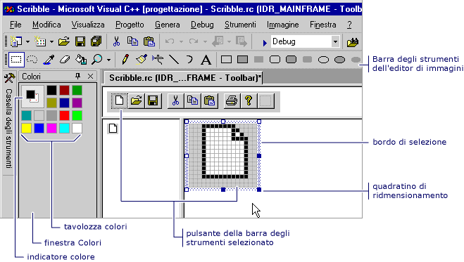

# Toolbar Editor
[!INCLUDE[vs2017banner](../assembler/inline/includes/vs2017banner.md)]

L'editor barra degli strumenti consente di creare risorse della barra degli strumenti e convertire le bitmap in risorse della barra degli strumenti. L'editor barra degli strumenti usa un'interfaccia grafica per visualizzare una barra degli strumenti e dei pulsanti con un aspetto molto simile a quello visualizzato in un'applicazione finita.  
  
 Con l'editor barra degli strumenti è possibile:  
  
-   [Creare nuove barre degli strumenti e pulsanti](../mfc/creating-new-toolbars.md)  
  
-   [Convertire le bitmap in risorse della barra degli strumenti](../mfc/converting-bitmaps-to-toolbars.md)  
  
-   [Creare, spostare e modificare i pulsanti della barra degli strumenti](../mfc/creating-moving-and-editing-toolbar-buttons.md)  
  
-   [Creare descrizioni comandi](../mfc/creating-a-tool-tip-for-a-toolbar-button.md)  
  
 La finestra Editor barra degli strumenti mostra due visualizzazioni di un'immagine del pulsante, uguali a quelle della finestra Editor di immagini. Una barra di divisione separa i due riquadri. che è possibile trascinare da un lato all'altro per modificare le dimensioni relative dei riquadri. Nel riquadro attivo viene visualizzato un bordo di selezione. Sopra le due visualizzazioni dell'immagine si trova la barra degli strumenti dell'oggetto.  
  
   
Editor barra degli strumenti  
  
 Le funzionalità dell'editor barra degli strumenti sono simili a quelle dell'editor di immagini. Le voci di menu, gli strumenti grafici e la griglia delle bitmap sono identici a quelli nell'editor di immagini. Nel menu Immagine è presente un comando di menu che consente di passare dall'editor barra degli strumenti all'editor di immagini e viceversa. Per altre informazioni sull'uso della barra degli strumenti grafica, la tavolozza di colori o il menu Immagine, vedere [Editor di immagini](../mfc/image-editor-for-icons.md).  
  
 Per informazioni sull'aggiunta di risorse a progetti gestiti, vedere [Risorse nelle applicazioni](../Topic/Resources%20in%20Desktop%20Apps.md) nella *Guida per gli sviluppatori di .NET Framework.* Per informazioni sull'aggiunta manuale di file di risorse a progetti gestiti, sull'accesso alle risorse, sulla visualizzazione di risorse statiche e sull'assegnazione di stringhe di risorse alle proprietà, vedere [Procedura dettagliata: Localizzazione di Windows Form](http://msdn.microsoft.com/it-it/9a96220d-a19b-4de0-9f48-01e5d82679e5) e [Walkthrough: Using Resources for Localization with ASP.NET](../Topic/Walkthrough:%20Using%20Resources%20for%20Localization%20with%20ASP.NET.md).  
  
## Requisiti  
 MFC o ATL  
  
## Vedere anche  
 [Resource Editors](../mfc/resource-editors.md)   
 [Menu e altre risorse](http://msdn.microsoft.com/library/windows/desktop/ms632583.aspx)